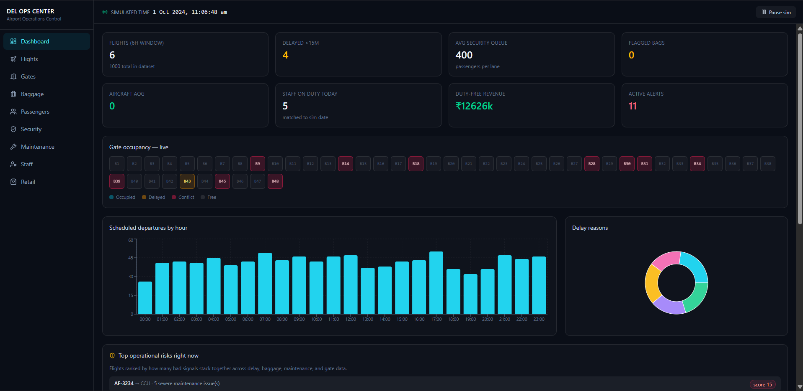

# ✈️ DEL Airport Operations Control Center — Frontend Wars 2026 Grand Finale

> A production-quality Airport Operations Control Center built for the **Frontend Wars 2026 Grand Finale**. The application transforms multiple airport datasets into a unified operational dashboard with simulated real-time updates, monitoring, alerts, and operational controls.

## 🌐 Live Demo

**Live:** https://airport-control-eight.vercel.app/

## 📂 GitHub Repository

**Repository:** https://github.com/anurag2882/airport-control.git

## 📸 Preview




---

# 🛠 Tech Stack

- React
- TypeScript
- Vite
- Tailwind CSS v4
- Zustand
- React Router
- PapaParse
- Recharts

---

# 🚀 Run Locally

```bash
npm install
npm run dev
```

---

# ✨ Features

### 📊 Dashboard

- Airport-wide KPI cards
- Live Operations Feed
- Live Alerts Panel
- Delay Reason Analytics
- Hourly Departure Volume
- Mission Control Dashboard

### 📁 Data Layer

- Raw CSV datasets cleaned and mapped into typed interfaces.
- CSV parsing handled using PapaParse.
- Strong TypeScript interfaces for every dataset.
- All data is loaded client-side from `public/data`.

### ⏱ Simulated Real-Time Engine

- Virtual airport clock advancing every 1.5 seconds.
- Dynamic flight status updates.
- Live alerts generated relative to the simulated time.
- Continuous event progression using the provided static dataset.

### ✈️ Flight Operations

- Searchable flight table
- Sortable columns
- Flight status filters
- On-time / Delayed filters
- Detailed flight information modal

### 🛫 Airport Operations Modules

Dedicated operational views for:

- Gates
- Baggage
- Passengers
- Security
- Maintenance
- Staff
- Retail

Each module supports searching, sorting, and operational monitoring using the shared `DataTable` component.

---

# 📊 Data Integration

Instead of treating each CSV independently, the application connects related operational data across multiple datasets.

```
Flight
├── Gate Events
├── Baggage
├── Passengers
├── Security
├── Maintenance
└── Staff
```

This creates a unified operational view rather than isolated dashboard pages.

---

# ⚡ Real-Time Simulation

Although the supplied dataset is static, the application simulates a live airport environment through frontend logic.

Features include:

- Live status updates
- Dynamic alerts
- Event feed
- Timeline progression
- Operational monitoring
- Auto-refreshing KPIs

No backend or external APIs are used.

---

# 📂 Folder Structure

```
src/
├── components/
├── pages/
├── store/
├── hooks/
├── types/
├── utils/
└── assets/

public/
└── data/

docs/
└── dashboard.png
```

---

# 🚀 Future Improvements

- Cross-table drill-downs connecting flights with baggage, passengers, and gate events.
- Additional operational alerts such as gate conflicts and staff shortages.
- Improved mobile navigation and responsiveness.
- More advanced airport analytics and operational insights.

---

# 📖 Schema Assumptions

Some datasets were provided without column headers.

Headers were inferred by analysing value patterns and documented separately in `SCHEMA_NOTES.md`.

These assumptions are documented to ensure transparency during judging.

---

# 👨‍💻 Author

**Anurag Mishra**

Built for **Frontend Wars 2026 Grand Finale**.

---